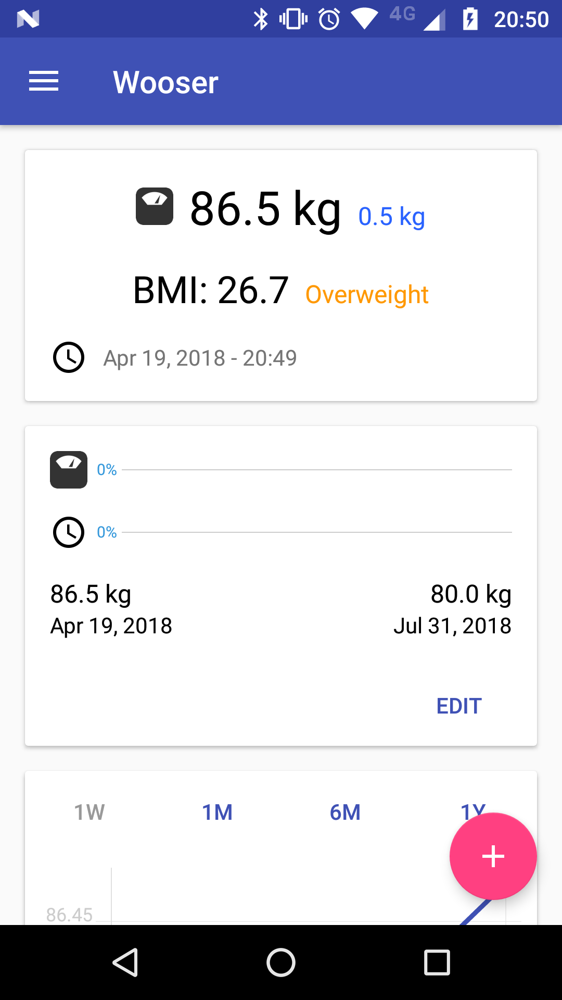

# udacity-FinalProject
This was my final project for the Udacity Android Nanodegree. One year ago, April 2017.

Students were required to mock and develop an entire app of their choice.
I then created Wooser, an app to track the users progress on body weight loss or gain.

